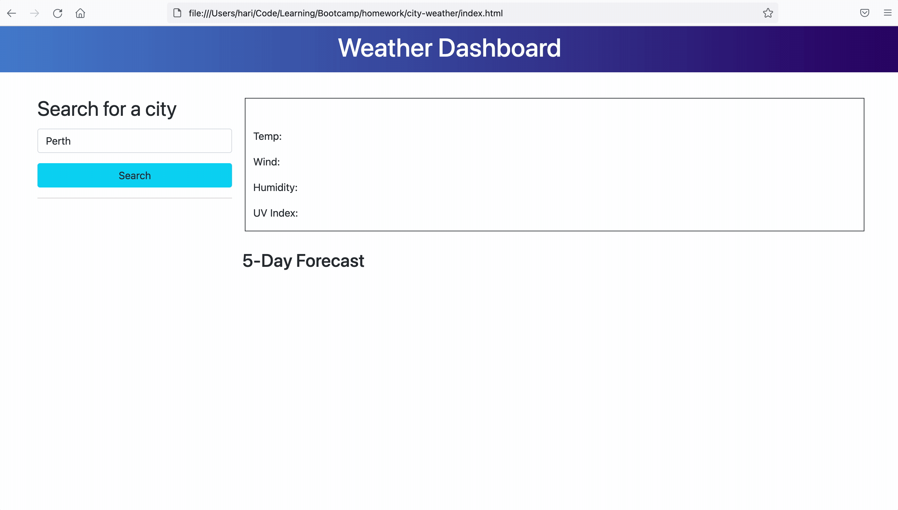

# City Weather (Weather Dashboard)

Build a weather dashboard that will run in the browser and feature dynamically updated HTML and CSS.

- This project was a part of a coding bootcamp activity, as homework.
- The user story and acceptance criteria were provided.
- This weather dashboard application uses HTML, Bootstrap, jQuery, MomentJS, CSS and JavaScript with LocalStorage & Server Side API (using Fetch) to fetch the weather and save the history of search.
- Building this application helped understand how to use Server Side APIs and combining the Third-Party frameworks to achieve the outcome.

### Screenshot

## Review

To review the final page from this source code please use the following link: [Click here](https://hari-ls.github.io/city-weather/)
